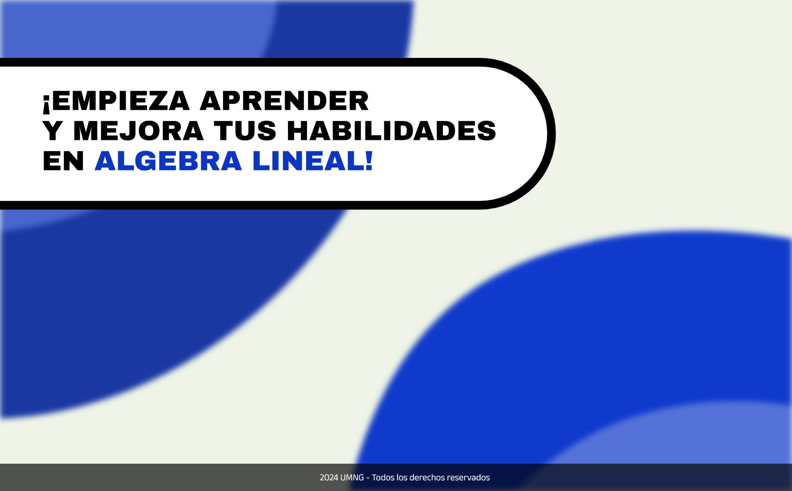
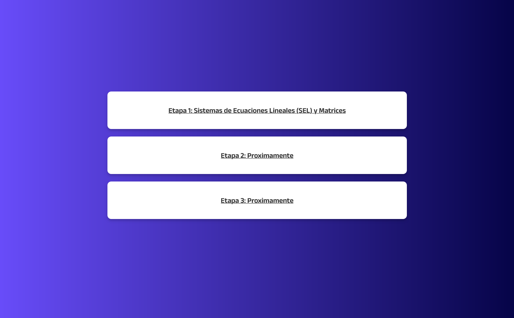
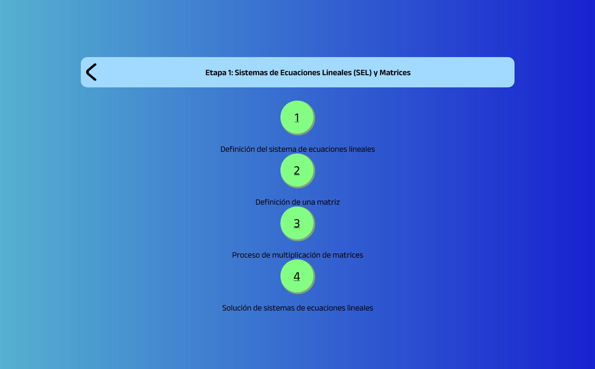
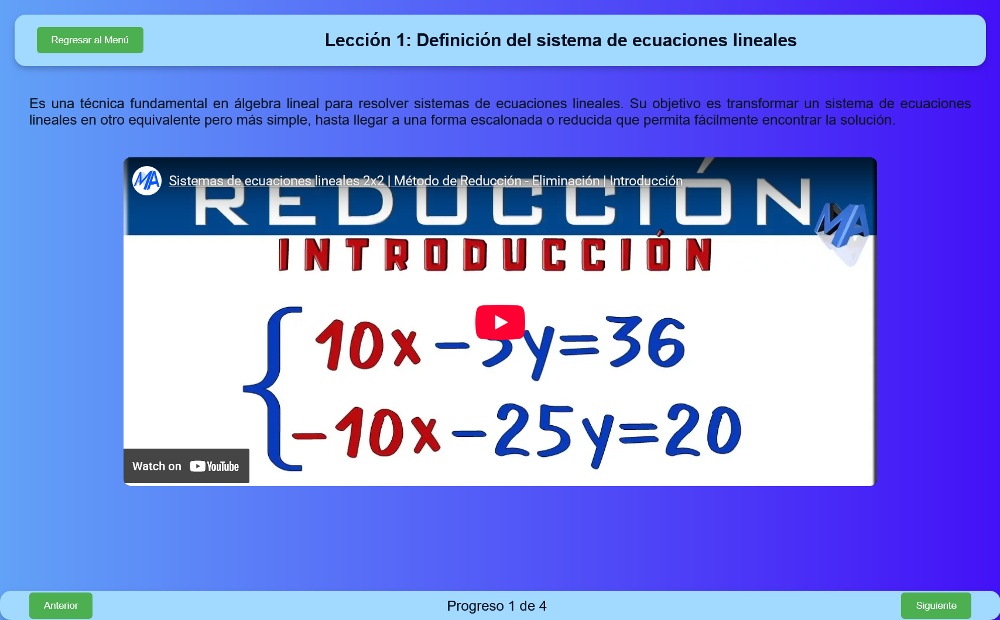

# Algebrain App

[🇪🇸 Español](#descripción-del-proyecto) | [🇺🇸 English](#project-description)

---

## 🇪🇸 Descripción del Proyecto

**Algebrain** es una aplicación web educativa e interactiva diseñada para facilitar el aprendizaje del Álgebra Lineal. El proyecto guía a los estudiantes a través de lecciones estructuradas, enfocándose inicialmente en Sistemas de Ecuaciones Lineales (SEL) y Matrices.

La aplicación combina teoría, videos explicativos y ejercicios prácticos con retroalimentación inmediata para asegurar la comprensión de los conceptos matemáticos.

### 🚀 Demo en Vivo
Puedes ver el proyecto funcionando aquí: **[Algebrain App](https://pintomultimedia2002.github.io/Algebrain-App/)**

### 📸 Capturas de Pantalla (Demo)

A continuación se muestra el flujo de la aplicación:

*Pantalla de bienvenida e inicio.*

*Menú principal para la selección de etapas de aprendizaje.*

*Mapa interactivo de lecciones paso a paso.*

*Interfaz de lección con contenido teórico, videos y navegación.*

### ✨ Características Principales

* **Aprendizaje Estructurado:** División por etapas (ej. SEL y Matrices) y lecciones secuenciales.
* **Contenido Multimedia:** Integración de videos de YouTube para explicaciones visuales.
* **Evaluación Interactiva:** Ejercicios de selección múltiple con validación inmediata de respuestas.
* **Interfaz Intuitiva:** Navegación sencilla y diseño limpio utilizando CSS moderno y animaciones.
* **Responsive Design:** Adaptable a diferentes tamaños de pantalla.

### 🛠️ Tecnologías Utilizadas

* **HTML5:** Estructura semántica del contenido.
* **CSS3:** Estilos personalizados, animaciones (`keyframes`) y diseño responsivo (Flexbox/Grid).
* **JavaScript (ES6+):** Lógica del cliente para el manejo del DOM, validación de respuestas y navegación dinámica entre lecciones.

### ✒️ Autores

Este proyecto fue desarrollado gracias al esfuerzo de:

* **David Pinto Gomez**
    * [LinkedIn](https://www.linkedin.com/in/pinto-gomez-david/)
    * [GitHub](https://github.com/pintomultimedia2002)

* **Santiago Henao Aguirre**
    * [LinkedIn](https://www.linkedin.com/in/santiago-henao-aguirre-a846682b1/)
    * [GitHub](https://github.com/Sant-Hen)

* **Artherx**
    * [GitHub](https://github.com/artherx)

---

## 🇺🇸 Project Description

**Algebrain** is an interactive educational web application designed to facilitate the learning of Linear Algebra. The project guides students through structured lessons, focusing initially on Systems of Linear Equations (SLE) and Matrices.

The application combines theory, explanatory videos, and practical exercises with immediate feedback to ensure understanding of mathematical concepts.

### 🚀 Live Demo
Check out the live project here: **[Algebrain App](https://pintomultimedia2002.github.io/Algebrain-App/)**

### 📸 Screenshots (Demo)

Below is the application flow:

*Welcome and start screen.*

*Main menu for selecting learning stages.*

*Interactive step-by-step lesson map.*

*Lesson interface with theoretical content, videos, and navigation.*

### ✨ Key Features

* **Structured Learning:** Division by stages (e.g., SLE and Matrices) and sequential lessons.
* **Multimedia Content:** Integration of YouTube videos for visual explanations.
* **Interactive Assessment:** Multiple-choice exercises with immediate answer validation.
* **Intuitive Interface:** Simple navigation and clean design using modern CSS and animations.
* **Responsive Design:** Adaptable to different screen sizes.

### 🛠️ Technologies Used

* **HTML5:** Semantic content structure.
* **CSS3:** Custom styles, animations (`keyframes`), and responsive design (Flexbox/Grid).
* **JavaScript (ES6+):** Client-side logic for DOM manipulation, answer validation, and dynamic navigation between lessons.

### ✒️ Authors

This project was developed thanks to the efforts of:

* **David Pinto Gomez**
    * [LinkedIn](https://www.linkedin.com/in/pinto-gomez-david/)
    * [GitHub](https://github.com/pintomultimedia2002)

* **Santiago Henao Aguirre**
    * [LinkedIn](https://www.linkedin.com/in/santiago-henao-aguirre-a846682b1/)
    * [GitHub](https://github.com/Sant-Hen)

* **Artherx**
    * [GitHub](https://github.com/artherx)

---
© 2024 UMNG - All rights reserved.
